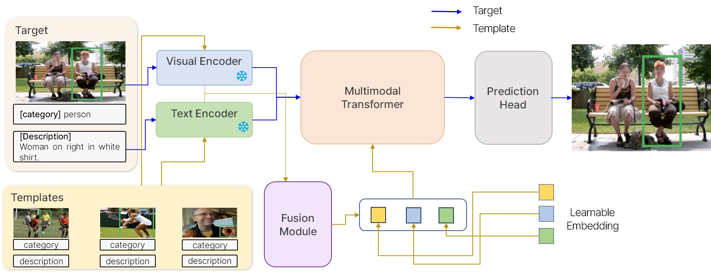
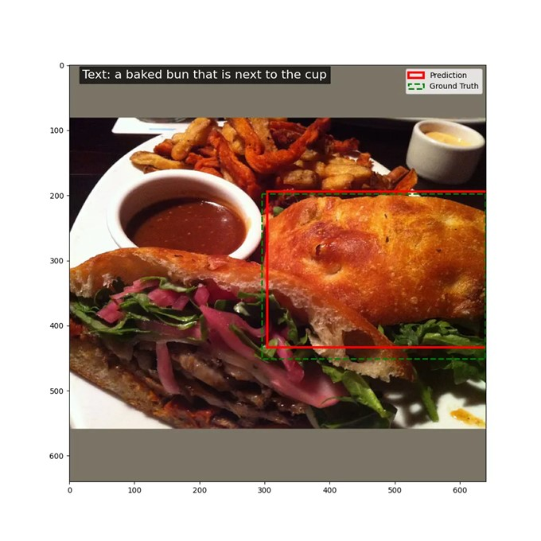
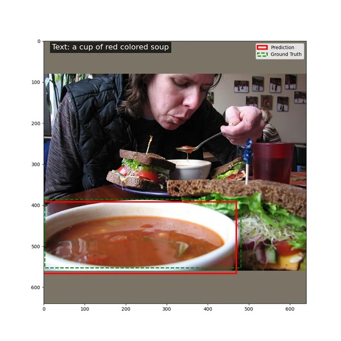

# Multimodal Few-shot Visual Grounding without Fine-tuning

We propose a model for  **Multimodal Few-shot Visual Grounding** without the need for fine-tuning. The proposed model architecture introduces an effective method for visual grounding using **few-shot learning** with the **Dynamic MDETR** model and enhances its performance using **multimodal prompts**, **cross-attention**, and **contrastive loss**.

## Table of Contents

- [Introduction](#introduction)
- [Framework](#framework)
- [Methodology](#methodology)
- [Dataset](#Datasets)
- [Evaluation](#evaluation)
- [Results](#results)
- [Conclusion](#conclusion)
- [Future Works](#future-works)
- [Contributions](#contributions)

## Introduction

Visual grounding tasks aim to identify objects in images that correspond to a given textual query. Traditional methods rely on **large-scale datasets** and **fine-tuning** for every new class or domain, which is not ideal for few-shot learning scenarios.

Our research addresses these limitations by proposing a model that:
1. Performs **few-shot visual grounding** without fine-tuning.
2. Utilizes **learnable embeddings** to enable the model to generalize to unseen classes.
3. Enhances performance using **cross-attention mechanisms** and **contrastive learning** for better multimodal integration.

<details>
   <summary>Training</summary>

## Requirement

```shell
conda create -n dynamic-mdetr python=3.10
conda activate dynamic-mdetr
bash install.txt
```

## Getting Started

Please refer to [GETTING_STARGTED.md](docs/GETTING_STARTED.md) to learn how to prepare the datasets and pretrained checkpoints.

## Training

[Checkpoints](https://drive.google.com/drive/folders/1stGPq4Sz_Vu60QliUzey8m6iYXrrF3Ua?usp=drive_link)

```shell
export CUDA_VISIBLE_DEVICES=0,1,2,3,4,5,6,7
# refcocog-g
python -m torch.distributed.launch --nproc_per_node=8 --use_env train.py --model_type ResNet --batch_size 16 --lr_bert 0.00001 --aug_crop --aug_scale --aug_translate --backbone resnet50 --pretrained_model ./checkpoints/best_checkpoint.pth  --bert_enc_num 12 --detr_enc_num 6 --dataset gref --max_query_len 40 --output_dir outputs/refcocog_gsplit_r50 --stages 3 --vl_fusion_enc_layers 3 --uniform_learnable True --in_points 36 --lr 1e-4 --different_transformer True --lr_drop 60 --vl_dec_layers 1 --vl_enc_layers 1 --clip_max_norm 1.0
```
## Eval

```shell
export CUDA_VISIBLE_DEVICES=0,1,2,3,4,5,6,7
# refcocog-g
python -m torch.distributed.launch --nproc_per_node=8 --use_env eval.py --model_type ResNet --batch_size 16 --backbone resnet50 --bert_enc_num 12 --detr_enc_num 6 --dataset gref --max_query_len 40 --output_dir outputs/refcocog_gsplit_r50 --stages 3 --vl_fusion_enc_layers 3 --uniform_learnable True --in_points 36 --lr 1e-4 --different_transformer True --lr_drop 60 --vl_dec_layers 1 --vl_enc_layers 1 --eval_model outputs/refcocog_gsplit_r50/best_checkpoint.pth --eval_set val


```

## Inference 

```shell
!python -m torch.distributed.launch --nproc_per_node=1 --use_env inference.py \
  --model_type ResNet \
  --batch_size 8 \
  --backbone resnet50 \
  --bert_enc_num 12 \
  --detr_enc_num 6 \
  --dataset gref \
  --max_query_len 40 \
  --output_dir outputs/refcocog_gsplit_r50/inference \
  --stages 3 \
  --vl_fusion_enc_layers 3 \
  --uniform_learnable True \
  --in_points 36 \
  --lr 1e-4 \
  --different_transformer True \
  --eval_model ./checkpoints/best_checkpoint_5.pth \
  --eval_set val \
```

</details>

## Framework

The core architecture builds on **Dynamic MDETR** (Dynamic Multimodal Transformer Decoder for Visual Grounding). We integrate the following components:
- **Multimodal Prompts**: Each template is composed of image features, text features, and a learnable embedding.
- **Cross-Attention Fusion Module**: This module allows for stronger interaction between the image and text modalities through bidirectional cross-attention.
- **Contrastive Loss**: Helps to maximize the difference between different-class templates and minimize intra-class template differences, further improving few-shot generalization.

### Architecture Overview



The proposed model is designed for **few-shot visual grounding**, leveraging **multimodal prompts** that combine visual and textual features with learnable embeddings. It builds on the **Dynamic MDETR** architecture, with enhancements like **cross-attention fusion** and **contrastive learning**. These innovations allow the model to generalize effectively to unseen classes without requiring fine-tuning.

**Multimodal prompts** are created using image features, text features, and learnable embeddings, which provide additional context for grounding. A **cross-attention fusion module** strengthens the interaction between the image and text, while **contrastive learning** further differentiates between classes to improve accuracy.


### Methodology

Our methodology introduces key techniques to enhance **few-shot visual grounding** performance. The core components include:

1. **Multimodal Prompt Generation**: We generate prompts by combining visual and textual features with learnable embeddings, allowing the model to leverage richer information during grounding tasks.
  
2. **Cross-Attention Fusion**: This module applies cross-attention between the image and text features, enhancing the integration of multimodal data to ensure more precise grounding.

3. **Contrastive Learning**: This loss function improves class differentiation by maximizing inter-class differences and minimizing intra-class variations, making the model more robust in distinguishing between same-class and different-class templates.

These innovations collectively improve the model's generalization ability, particularly in **few-shot learning** scenarios. 


## Datasets

We utilize two main datasets for pre-training and fine-tuning the model:
- **Pre-training Dataset**: RefCOCO, Flickr30k
- **Fine-tuning Dataset**: RefCOCOg

### Dataset Statistics
| Dataset       | #Images  | #Refer Expressions | Train Classes | Eval Classes |
|---------------|----------|--------------------|---------------|--------------|
| RefCOCO       | 19,994   | 142,209            | 70            | 10           |
| Flickr30k     | 31,000   | 5 refer/image      | -             | -            |
| RefCOCOg      | 25,799   | 142,209            | 70            | 10           |


## Evaluation
We performed two primary evaluations:
1. **Template-based Performance Evaluation**: Analyzing the effect of including templates (support set) with different architectures, including **Dynamic MDETR**.
2. **Unseen Class Evaluation**: Evaluating model generalization on unseen classes using fusion and contrastive loss.


#### Impact of Template on Performance (RefCOCOg)

| Methods                          | Backbone  | Support Set | Accuracy |
|-----------------------------------|-----------|-------------|----------|
| TransVG                          | ResNet-101| No          | 67.02%   |
| TransVG                          | ResNet-50 | No          | 66.56%   |
| TransVG++                        | ResNet-50 | No          | 73.86%   |
| GroundVLP                        | Vin-VL    | No          | 74.73%   |
| Dynamic MDETR                    | ResNet-50 | No          | 69.43%   |
| **Dynamic MDETR + FS-learnable embedding (ours)** | ResNet-50 | Yes        | **83.6%** |

The first experiment compares our **Dynamic MDETR + FS-learnable embedding** model with other visual grounding models. Our model, utilizing ResNet-50, achieves **83.6% accuracy**, significantly outperforming existing methods like **TransVG** and **GroundVLP**. 

Compared to **TransVG (ResNet-50)**, which recorded **66.56% accuracy**, our model achieved a **17% improvement**, indicating the effectiveness of incorporating **template-based support sets**. The use of **learnable embeddings** allowed our model to capture more fine-grained details, enhancing its performance by reducing confusion between similar classes.

The introduction of **templates** enabled richer visual information to be learned, improving the model’s ability to distinguish between classes. This experiment demonstrates the critical role of templates in enhancing model performance for few-shot learning.

#### Few-shot Visual Grounding on Unseen Data

| Methods                       | Backbone  | Accuracy | AP   |
|--------------------------------|-----------|----------|------|
| Ours                           | ResNet-50 | 0.30     | 0.53 |
| Ours + Fusion Module (Fu)      | ResNet-50 | 0.39 (+0.09) | 0.58 (+0.05) |
| Ours + Contrastive Loss (CI)   | ResNet-50 | 0.38 (+0.08) | 0.60 (+0.07) |
| Ours + Fu + CI                 | ResNet-50 | **0.39** (+0.09) | **0.60** (+0.07) |

In the second experiment, we evaluated the **few-shot visual grounding performance on unseen data**. Without any additional modules, our base model achieved **0.30 accuracy** and **0.53 AP**. 

However, when incorporating the **Fusion Module (Fu)**, the accuracy increased by **9%** to **0.39**, and AP improved by **5%** to **0.58**. The Fusion Module enhances the interaction between templates, making information sharing more effective.

With the addition of **Contrastive Loss (CI)**, accuracy and AP further improved to **0.38 and 0.60**, respectively. Contrastive Loss helps the model better distinguish between different-class templates while refining intra-class variations.

When combining both **Fusion Module and Contrastive Loss**, our model achieved the best results with **0.39 accuracy** and **0.60 AP**. This indicates that the combination of these components significantly improves the model's ability to generalize to unseen classes.

## Results
These experiments validate the effectiveness of our proposed **template-based multimodal prompt** and **learnable embeddings** in improving visual grounding performance. The **Fusion Module** and **Contrastive Loss** play crucial roles in enhancing the interaction between visual and textual information, leading to better generalization, especially for unseen classes.

The model achieves a significant improvement in both accuracy and AP with the introduction of the **Fusion Module** and **Contrastive Loss**. The few-shot visual grounding performance is highly enhanced on unseen data with up to **9% increase in accuracy** and **7% increase in AP**.

### Visual Results:

Below are the visualization results showing the model's predictions and the ground truth for few-shot visual grounding tasks.
<p align="center">
  
  
  
</p>

## Conclusion

The proposed model successfully addresses the challenges of few-shot visual grounding without fine-tuning by introducing:
- **Multimodal prompts** with templates.
- A **cross-attention fusion mechanism** for improved multimodal feature interaction.
- **Contrastive learning** to enhance class differentiation.
  
The results demonstrate strong generalization abilities, with superior performance on unseen data.

## Contributions

- **Cross-Attention Fusion Module**: Enhances multimodal interaction between templates and queries.
- **Learnable Embedding in Templates**: Allows for more dynamic and flexible feature learning.
- **Contrastive Learning**: Maximizes the effectiveness of few-shot learning by enhancing class distinction.
